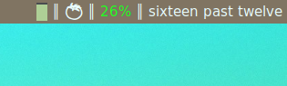
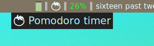
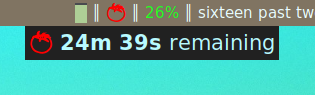
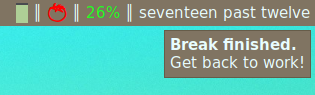

Pomodoro Timer for AwesomeWM
===

 
 

Images: 1) timer widget sitting in the wibox, off; 2) hovering over the widget;
3) just after left-clicking: work time, 4) notification at the end of a break
(already back in work time)

Also pictured is my
[alsa widget](https://github.com/rperce/dotfiles/blob/master/awesome/.config/awesome/widgets/alsa.lua),
[battery widget](https://github.com/rperce/dotfiles/blob/master/awesome/.config/awesome/widgets/battery.lua),
and
[english-word clock](https://github.com/rperce/dotfiles/blob/master/awesome/.config/awesome/widgets/clock.lua),
the last of which uses
[this small ruby program](https://github.com/rperce/dotfiles/blob/master/path/path/wordtime).

Installation
---
```bash
$ cd ${XDG_CONFIG_HOME:-.config}/awesome
$ git clone https://github.com/rperce/pomodoro-awm.git
```

and edit your `rc.lua` to do something like
```lua
...
-- widget definitions
local pomodoro_widget = require('pomodoro-awm/pomodoro')
...
for s = 1, screen.count() do
    -- Widgets that are aligned to the right
    local right_layout = wibox.layout.fixed.horizontal()
    ...
    right_layout:add(pomodoro_widget)
    ...
end
...
-- bindings, etc.
...
```

And restart AwesomeWM (Mod4 + Ctrl + r, by default).

Features
---
* Left click starts (if currently off) or pauses/unpauses
* Right click skips current period
* Middle click turns timer off
* Easy to configure:
 - work and rest times (default: 25m and 5m, respectively)
 - number of pomodoros before a long break (default: 4)
 - if long breaks occur at all (default: yes)
 - if time remaining is displayed in widget (default: yes)
 - automatically pause timer after a rest (default: no)
 - sound on session end (default: yes)
 - colors (default: off=`beautiful.fg_normal`, work=#ff0000, work-pause=#aa5500, rest=#11cc00, rest-pause=#ddcc00)
 - widget icon (default: a unicode tomato, &#x1f345;)
 - notification messages (default: 'Break finished./Get back to work!' and 'Work complete./Time for a break!')

License
---
This Source Code Form is subject to the terms of the Mozilla Public License, v. 2.0. If a copy of the MPL was not distributed with this file, You can obtain one at https://mozilla.org/MPL/2.0/.
