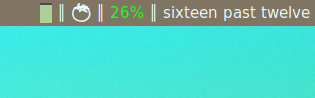
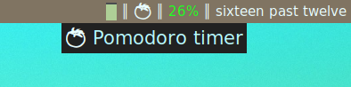
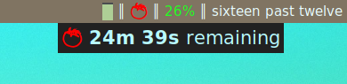
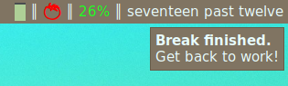

Pomodoro Timer for AwesomeWM
===

Timer widget sitting in the wibox

 
 

Images: 1) timer widget sitting in the wibox, 2) hovering over the widget;

3) just after left-clicking, 4) notification at the end of a break

